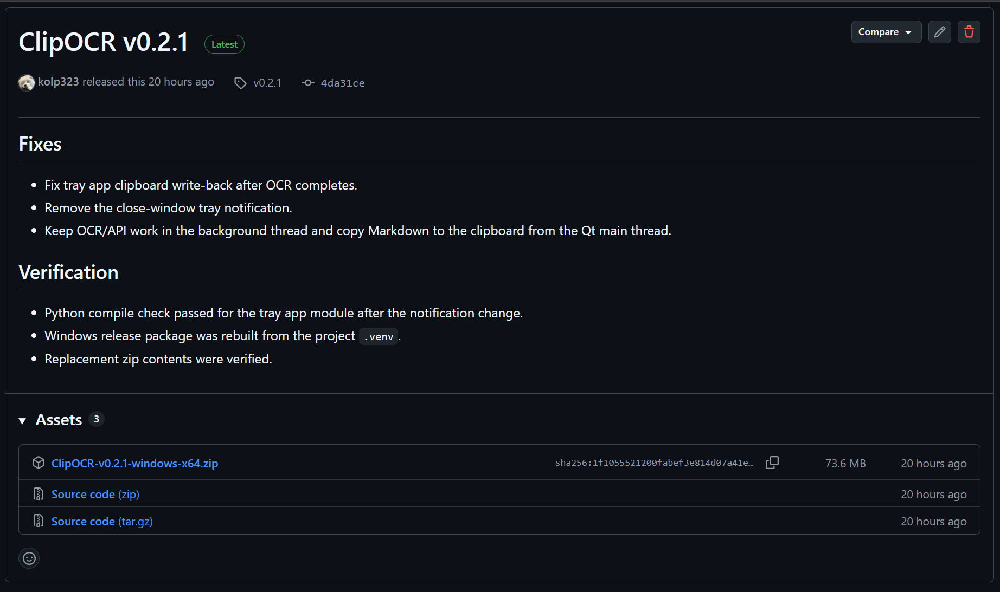
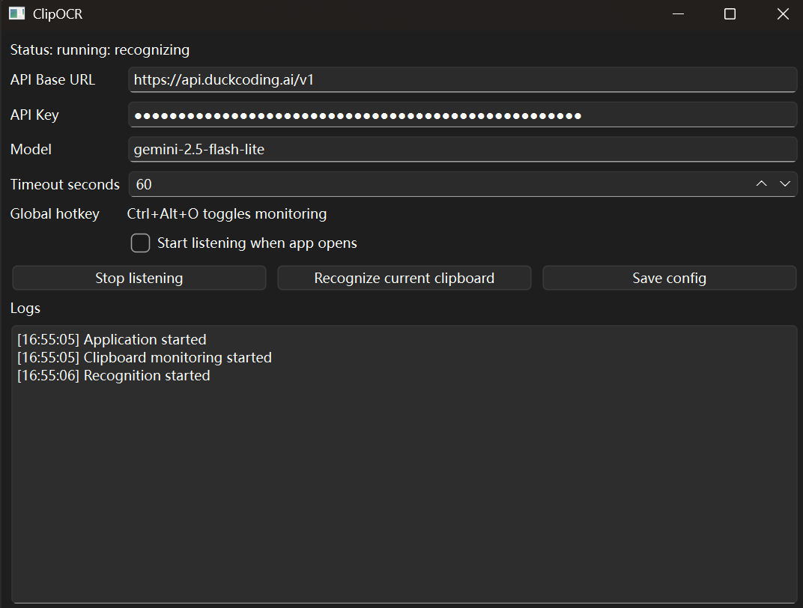

# Windows 截图自动转 Markdown 工具 ClipOCR：支持托盘监听、OCR 识别和剪贴板写回

摘要：ClipOCR 是一个 Windows 托盘 OCR 工具，可以监听剪贴板截图，调用兼容 OpenAI Vision Chat Completions 的视觉模型进行 OCR 和版面理解，并自动输出 Markdown 到剪贴板。本文介绍 ClipOCR 的下载、配置、使用方法和常见问题。

关键词：Windows OCR、截图转文字、Markdown、Python、PySide6、剪贴板 OCR、AI OCR、OpenAI Vision

## 一、工具介绍

ClipOCR 是一个轻量级 Windows OCR 工具，主要用于将剪贴板中的截图自动识别为 Markdown 文本。

它的核心流程是：

```text
复制截图 -> ClipOCR 检测剪贴板图片 -> 调用视觉模型 OCR -> 整理为 Markdown -> 写回剪贴板
```

识别完成后，用户只需要按 `Ctrl+V`，就可以把生成的 Markdown 粘贴到编辑器中。

项目地址：

```text
https://github.com/kolp323/ClipOCR
```

下载地址：

```text
https://github.com/kolp323/ClipOCR/releases/tag/v0.2.1
```

## 二、主要功能

ClipOCR 当前支持以下功能：

- Windows 托盘常驻运行
- 图形界面配置 API 参数
- 自动保存和加载配置
- 监听剪贴板截图
- 手动识别当前剪贴板图片
- 识别完成后自动写回剪贴板
- 支持全局快捷键 `Ctrl+Alt+O`
- 支持 OpenAI-compatible Vision Chat Completions API
- 支持本地日志
- 同时提供命令行版本

## 三、适用场景

ClipOCR 适合以下场景：

1. 从论文截图中提取文字
2. 从课件截图中整理笔记
3. 将网页截图转换为 Markdown
4. 将图片表格转换为 Markdown 表格
5. 将代码截图转换为 Markdown 代码块
6. 将截图内容粘贴到 Obsidian、Typora、Notion 或 VS Code

## 四、下载安装

打开 GitHub Release 页面：

```text
https://github.com/kolp323/ClipOCR/releases/tag/v0.2.1
```

下载 Windows 压缩包：

```text
ClipOCR-v0.2.1-windows-x64.zip
```

解压后目录中包含：

```text
clipocr.exe
clipocr-cli.exe
README.md
README.zh-CN.md
```

其中：

- `clipocr.exe` 是 Windows 桌面托盘版本
- `clipocr-cli.exe` 是命令行版本
- `README.md` 是英文说明
- `README.zh-CN.md` 是中文说明



## 五、启动桌面程序

双击运行：

```text
clipocr.exe
```

程序启动后会显示主窗口，并在 Windows 托盘区创建图标。

如果关闭窗口，程序不会立即退出，而是隐藏到托盘继续运行。

如果需要完全退出，请在托盘菜单中选择：

```text
Quit
```

## 六、配置 API 参数

第一次运行时，需要在窗口中填写 API 参数。

需要填写的字段包括：

| 字段 | 说明 |
| --- | --- |
| API Base URL | API 基础地址 |
| API Key | API 密钥 |
| Model | 支持图片输入的视觉模型名称 |
| Timeout seconds | 请求超时时间 |

示例配置：



填写完成后点击：

```text
Save config
```

配置会自动保存到本地：

```text
config.json
```

下次启动程序时，ClipOCR 会自动加载之前保存的配置。

注意：`config.json` 是本地配置文件，不应提交到公开仓库。


## 七、开始监听剪贴板

配置完成后，点击窗口中的：

```text
Start listening
```

程序状态会变为：

```text
running: waiting for screenshot
```

此时 ClipOCR 会开始监听剪贴板中的图片。

也可以使用快捷键切换监听状态：

```text
Ctrl+Alt+O
```

再次按下快捷键，可以停止监听。


## 八、复制截图进行识别

接下来，使用任意截图工具复制一张截图到剪贴板。

可以使用：

- Windows 截图工具
- 微信截图
- QQ 截图
- 浏览器截图
- PDF 阅读器截图

只要剪贴板中的内容是图片，ClipOCR 就会检测到并开始识别。

识别过程中状态为：

```text
running: recognizing
```

识别完成后状态为：

```text
running: completed
```

此时识别结果已经自动写入剪贴板。


## 九、粘贴 Markdown 结果

打开 Markdown 编辑器，例如：

- Obsidian
- Typora
- VS Code
- Notion
- Markdown Preview Editor

按下：

```text
Ctrl+V
```

即可粘贴识别后的 Markdown。

示例输出：

```markdown
# Meeting Notes

## Action Items

- Update the project README
- Verify the OCR workflow on Windows
- Publish the demo blog post

| Item | Owner | Status |
| --- | --- | --- |
| CLI MVP | Alice | Done |
| GUI | Later | Planned |
```

ClipOCR 会尽量保留：

- 标题
- 段落
- 列表
- 表格
- 代码块
- 合理空行

> 图片建议：左侧为原始截图，右侧为粘贴后的 Markdown 文本。

## 十、托盘菜单说明

ClipOCR 支持托盘菜单操作。

常用菜单包括：

| 菜单项 | 作用 |
| --- | --- |
| Open ClipOCR | 打开主窗口 |
| Start listening | 开始监听剪贴板 |
| Stop listening | 停止监听剪贴板 |
| Recognize current clipboard | 手动识别当前剪贴板图片 |
| Quit | 退出程序 |

窗口右上角关闭按钮只会隐藏窗口，不会退出程序。

如果需要退出，请使用托盘菜单中的 `Quit`。

> 图片建议：Windows 托盘菜单截图。

## 十一、命令行版本使用

ClipOCR 也提供命令行版本：

```powershell
.\clipocr-cli.exe
```

如果希望将识别结果打印到终端，可以使用：

```powershell
.\clipocr-cli.exe --print
```

源码运行方式：

```powershell
python clipocr.py --print
```

CLI 和桌面版读取同一个 `config.json` 配置文件。

## 十二、常见问题

### 1. 托盘图标一直处于等待状态怎么办？

说明 ClipOCR 正在等待剪贴板中的图片。

请确认复制的是截图图片，而不是普通文本。

### 2. 识别失败怎么办？

可以检查以下内容：

- API Key 是否正确
- 模型是否支持图片输入
- Base URL 是否兼容 OpenAI `/v1/chat/completions`
- 网络连接是否正常
- 截图是否过大

### 3. 识别完成后为什么粘贴不到内容？

请确认使用的是 `v0.2.1` 或更新版本。

`v0.2.1` 修复了桌面版识别完成后剪贴板写回不稳定的问题。

### 4. 配置文件在哪里？

配置文件位于程序目录下：

```text
config.json
```

日志文件位于：

```text
logs/clipocr.log
```

### 5. API Key 是否安全？

API Key 保存在本地 `config.json` 中。

建议使用专门为该工具创建的 API Key，不要使用主账号长期高权限 Key。

## 十三、当前限制

ClipOCR 目前仍是轻量工具，存在一些限制：

- 主要支持 Windows 桌面环境
- Linux 目前偏命令行支持
- API 必须兼容 OpenAI Chat Completions 图片输入格式
- OCR 质量取决于模型能力和截图清晰度
- 同一时间只处理一张截图
- 暂无 OCR 历史数据库

## 十四、配图清单

建议准备这些图：

1. GitHub Release 下载页，框出 `ClipOCR-v0.2.1-windows-x64.zip`
2. 解压后的文件夹，框出 `clipocr.exe`
3. ClipOCR 主窗口配置页，API Key 打码
4. 点击 `Start listening` 后的运行状态
5. 一张待识别截图，最好包含标题、列表、表格
6. 日志显示 `Recognition completed`
7. 在 Obsidian / Typora / VS Code 中 `Ctrl+V` 后的 Markdown 效果

## 十五、总结

ClipOCR 的目标是简化截图 OCR 流程。

传统流程可能是：

```text
截图 -> 打开 OCR 软件 -> 上传图片 -> 复制文字 -> 手动整理格式
```

ClipOCR 希望把这个流程简化为：

```text
复制截图 -> 等待识别 -> Ctrl+V 粘贴 Markdown
```

如果你经常需要从截图中提取内容，并且希望结果更适合 Markdown 笔记、博客或文档，ClipOCR 会比较适合。

项目地址：

```text
https://github.com/kolp323/ClipOCR
```

Release 下载：

```text
https://github.com/kolp323/ClipOCR/releases/tag/v0.2.1
```
